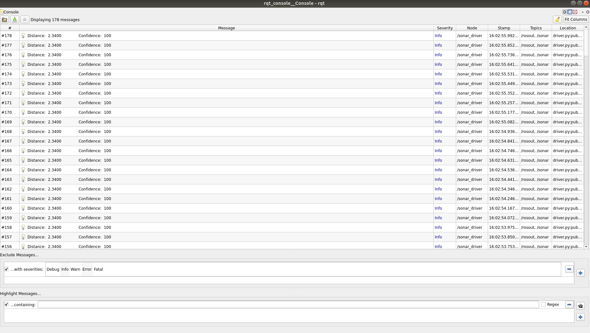
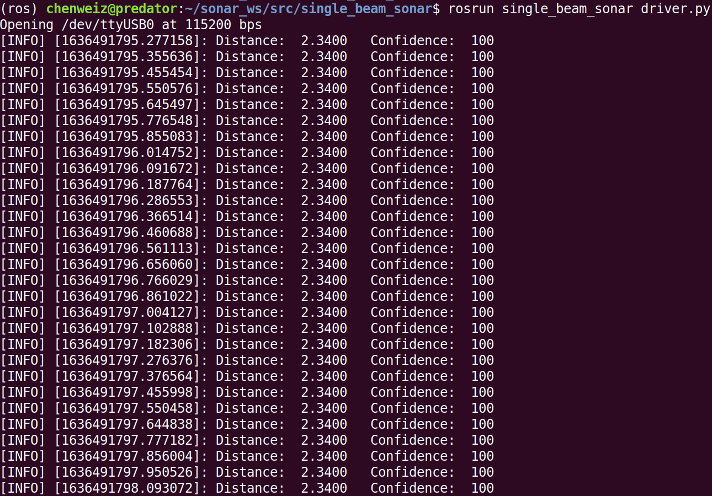
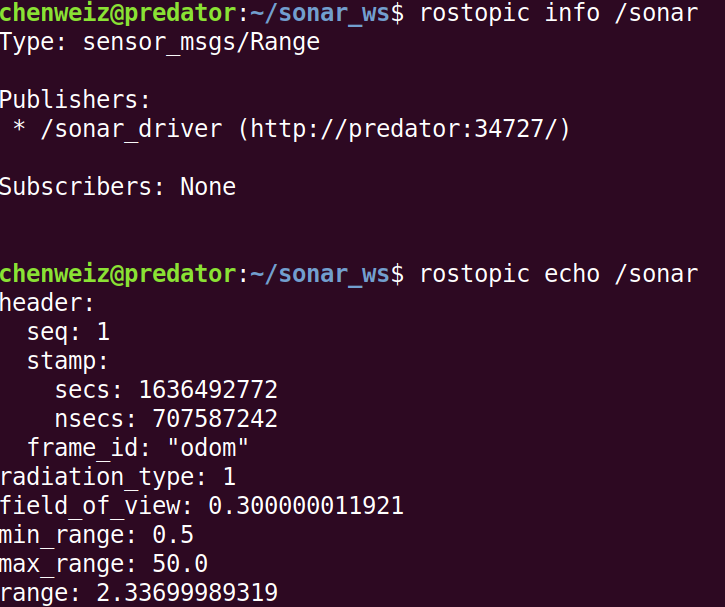

# ROS Driver of The Single Beam Sonar from BlueRobotics
`bluerobotics-ping` requires Python3. We create the `ROS Noetic` virtual environment in Conda so that this package can be used on Ubuntu 16.04/18.04 as well. 

1. Install `Miniconda`: https://docs.conda.io/en/latest/miniconda.html
2. Follow https://github.com/RoboStack/ros-noetic to create a `ROS Noetic` virtual environment called `ros`
1. Create a catkin workspace if necessary

  ```bash
  mkdir -p ~/sonar_ws/src
  ```
2. Clone this repo
  ```bash
  cd ~/sonar_ws/src
  git clone https://github.com/Weizhe-Chen/single_beam_sonar.git
  ```
3. Install `ping-python` to read the sonar data
  ```bash
  conda activate ros
  # 
  pip install bluerobotics-ping
  ```
4. Build the package
  ```bash
  cd ~/sonar_ws/
  catkin build
  . devel/setup.bash
  ```
5. Launch the driver
  ```bash
  roslaunch single_beam_sonar driver.launch
  ```
6. Check the published data
  ```bash
  rqt_console
  ```



7. Alternatively, we can run the node directly rather than doing step 5 and 6
  ```bash
  # In another terminal
  roscore
  # In the terminal with conda virtualenv and ~/sonar_ws/devel/setup.sh sourced
  rosrun single_beam_sonar driver.py
  ```



8. Check rostopic

   ```bash
   rostopic info /sonar
   rostopic echo /sonar
   ```

   
